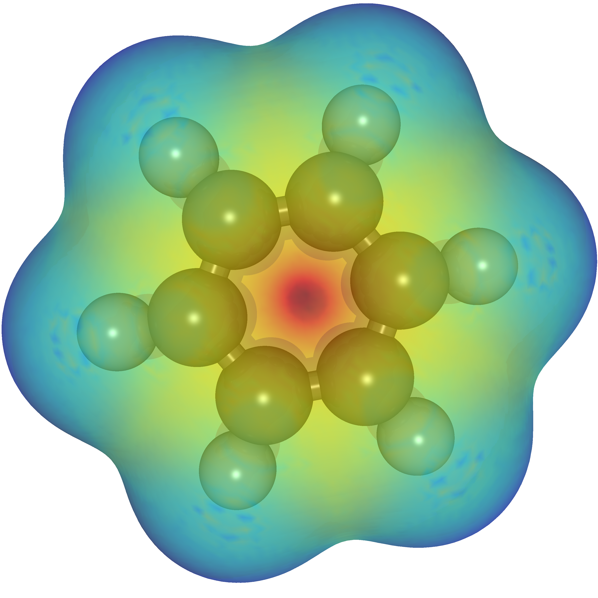

# molecular-rendering

Tools to render high quality molecular images and videos by POVRAY

## Binder links for the apps
**Due to the computing power limitation provided by Binder, it will take long time 
to generate the images and videos.**

* Render molecular strcutures to high quality images

* Render molecular trajectories to high quality movies

* Plot electrostatic colormap from VASP calculations

## Gallery

* The electrostatic colormap of the benzene (C6H6) molecule

## Acknowlegements

We acknowledge support from:
* EPFL Open Science Fund

