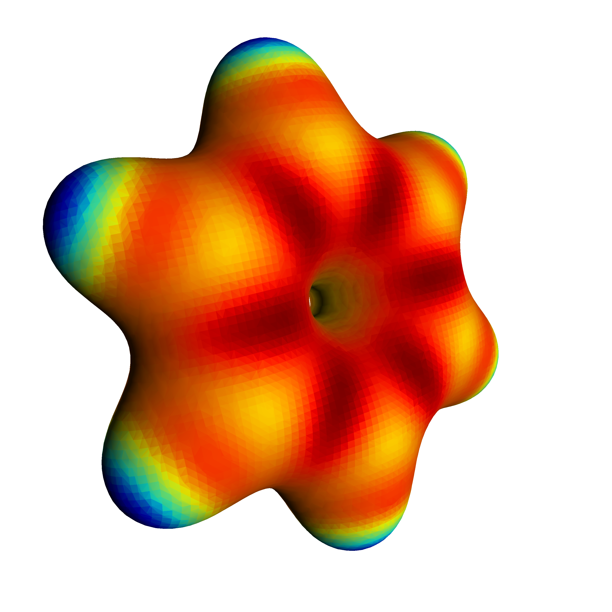

# molecular-rendering

Tools to render high quality molecular images and videos by POVRAY

## Binder links for the apps

* Render molecular strcutures to high quality images

* Render molecular trajectories to high quality movies

## Gallery

* The electrostatic colormap of the benzene (C6H6) molecule 

## Acknowlegements

We acknowledge support from:
* EPFL Open Science Fund

